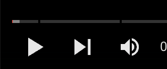

# video streaming server by nodejs

## What you can learn

How to play a video with only requesting a partial content of this video, but not requesting the whole video in one time.

## Tools

1. nodejs + express

## Run on local

1. git clone this project
2. run `npm ci`
3. run `npm start`, make sure you aren't running any application on port 8000

## Concept

1. 當你打開 youtube 播放影片時，你會看到這樣的時間軸圖
   - 
2. 這是表示播放這個影片時，前端只跟後端索取了那一小段白色區段的影片內容，使用者目前只能看到白色區段，後面灰色區段其實是不能看的
3. 當他看完白色區段後，或是他按下了灰色區段某個時間點，前端會自動去索取下一段的影片內容，讓他可以繼續往下看
4. 一直重複這個步驟，直到影片播完為止
5. 這種串流類型的影片播映方式，雖然會讓前端一直跟後端發請求，但至少不用一次獲取所有影片內容後，使用者才能看
6. 想想如果你今天是看一個一小時的美國影集，假設後端是發「整個」影片過來，那要等多久才能看呀！？一小時高清影集很大欸！
7. 相反地，這種一次只拿一點點的，就可以等一下下就能馬上看了！
8. 但這種方式有個缺點：就是會瘋狂跟後端發請求

## Flaw

這份程式碼很陽春，所以有個小問題

1. 假設你已經看過三十秒到三十五秒的區段了，然後現在你看到兩分鐘的地方，覺得三十秒那裡太好看了我重看一次！
2. 於是你點擊了三十秒的時間點，前端就自動又發了一個請求到後端去求三十秒以後的影片內容
3. 但其實這段影片，前端已經有了！再跟後端要很費時費資源
4. 所以未來有辦法優化這個程式碼的話，希望能解決這個問題
   - 目前有些瀏覽器好像會自動實作快取功能，讓前端少發請求，自動從快取拿看過的影片部分
   - 但也有人說：前端就該手動加工把看過的快取，別靠瀏覽器， 詳細還沒深究！

## Resource

- [video](https://www.youtube.com/watch?v=ZjBLbXUuyWg)
- [Original Repo](https://github.com/Abdisalan/blog-code-examples/tree/main/http-video-stream)
